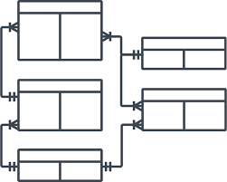

# Figures

(ref:arch-caption) Entity relationship diagram of the data model used by ANDES.

```{r arch, fig.cap="(ref:arch-caption)", out.width='1.0\\linewidth'}
knitr::include_graphics("./figures/architecture.pdf")
```
\clearpage


(ref:ERD-caption) Entity relationship diagram of the data model used by ANDES.

```{r ERD, fig.cap="(ref:ERD-caption)", out.width='1.0\\linewidth'}

```
\clearpage

(ref:andes-splashpage-caption) User interface of Another data entry system (Andes) showing the eight principal components of the application.

```{r andes-splashpage, fig.cap="(ref:andes-splashpage-caption)", out.width='1.0\\linewidth'}
knitr::include_graphics("./figures/andes-splash.png")
```
\clearpage


(ref:andes-wetlab1-caption) User interface of the Ecosystem Survey component of Andes when in use for processing samples in the wet laboratory. The screen capture presented here shows sampling of capelin lengths on an active set being processed in the lab.

```{r andes-wetlab1, fig.cap="(ref:andes-wetlab1-caption)", out.width='1.0\\linewidth'}
knitr::include_graphics("./figures/andes-wetlab1.png")
```
\clearpage

(ref:portsampling1-caption) User interface of the Port sampling component of Andes when in use for processing samples in the field.

```{r portsampling1, fig.cap="(ref:portsampling1-caption)", out.width='1.0\\linewidth'}
knitr::include_graphics("./figures/portsampling1.png")
```
\clearpage

