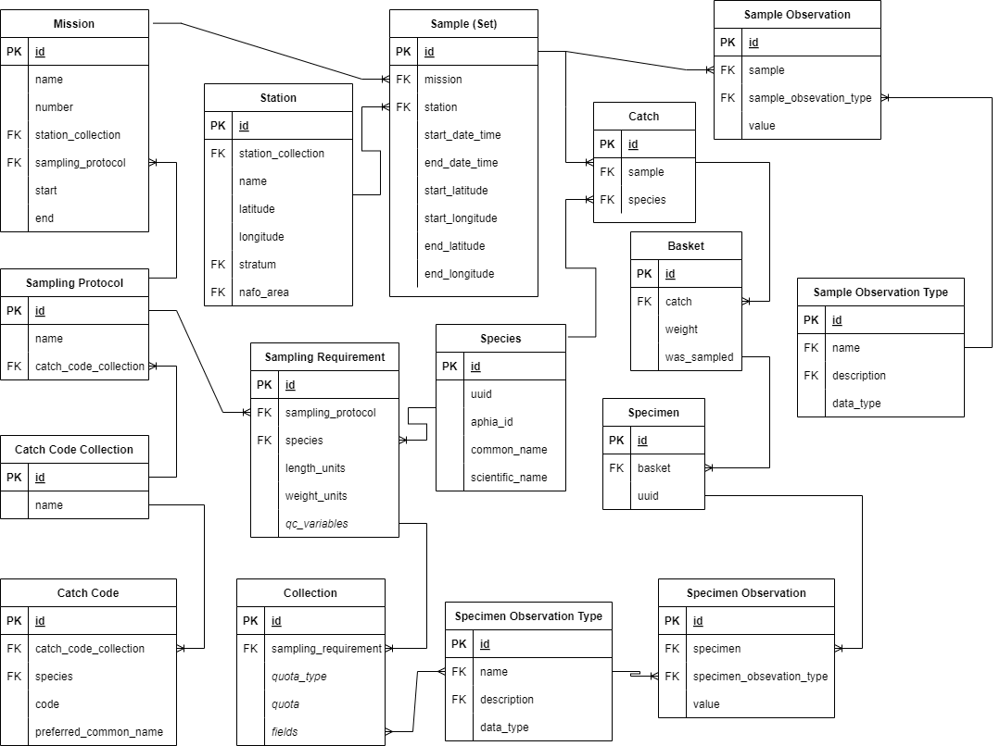

# Figures

(ref:arch-caption) The generalized system architecture diagram of the Andes application and its associated services.
```{r arch, fig.cap="(ref:arch-caption)", out.width='1.0\\linewidth'}
knitr::include_graphics("./figures/architecture.png")
```
\clearpage

(ref:screenshot-fishing-console-caption) A screenshot of Andes Fishing Console withing the Bridge App. This screenshot shows some quality control validation features including: the fishing timer, the distance display and an alarm message for when the vessel is travelling outside the target stratum. On the bottom left of the screenshot, output from the net monitoring system is displayed. The large buttons in the center of the display are used to trigger fishing events.
```{r screenshot-fishing-console, fig.cap="(ref:screenshot-fishing-console-caption)", out.width='1.0\\linewidth'}

```
\clearpage

(ref:ab-form-caption) A screenshot of the "Length-to-Weight Ratio" section of the sampling requirement form. Andes offers the option to specify regression coefficients for males, females or unspecified individuals to be used in quality control.
```{r screenshot-ab-form, fig.cap="(ref:ab-form-caption)", out.width='1.0\\linewidth'}
knitr::include_graphics("./figures/screenshot_qc_ab_form.png")
```
\clearpage

(ref:mature-length-form-caption) A screenshot of the "Mature Length" section of the sampling requirement form. Andes offers the option to specify mature length thresholds for males, females or unspecified individuals to be used in quality control.
```{r screenshot-mature-length-form, fig.cap="(ref:mature-length-form-caption)", out.width='1.0\\linewidth'}
knitr::include_graphics("./figures/screenshot_qc_mature_length_form.png")
```
\clearpage

(ref:screenshot-index-caption) A screenshot of the main index page of Another data entry system (Andes) showing the principal modules of the application. Which are displayed on the index page will depend both the users permissions and profile.
```{r screenshot-index, fig.cap="(ref:screenshot-index-caption)", out.width='1.0\\linewidth'}

```
\clearpage


(ref:bridge-caption) A screenshot of the Andes Bridge console. This app is used by bridge personnel across multiple user scenarios. This dashboard is a critical link in the communication between the scientist and crew personnel. An example of this is the station list; as a chief scientist plans out his or her route, queue stations and the associated activities will appear in the Bridge console. The Bridge console is also used by bridge officers to trigger the start and ends of operations and to input set metadata.

```{r screenshot-bridge-console, fig.cap="(ref:bridge-caption)", out.width='1.0\\linewidth'}
knitr::include_graphics("./figures/screenshot_bridge_console.png")
```
\clearpage

(ref:dashboard-caption) A screenshot of the Andes Cruise Dashboard. This dashboard helps to communicate queued stations, fishing activities underway and estimated times of arrival to science staff and crew personnel. The dashboard also displays high level summaries of Science activities that were conducted.
```{r screenshot-dashboard, fig.cap="(ref:dashboard-caption)", out.width='1.0\\linewidth'}
knitr::include_graphics("./figures/screenshot_dashboard.png")
```
\clearpage

(ref:erd-ecosystem-survey-caption) A simplified entity relationship diagram of the data model used by the Ecosystem Survey app of \gls{andes}.
```{r erd-ecosystem-survey, fig.cap="(ref:erd-ecosystem-survey-caption)", out.width='1.0\\linewidth'}

```
\clearpage

(ref:screenshot-wetlab-active-set-caption) A screenshot of the Active Set page. This page is a component of the Ecosystem Survey app. Users in the wet laboratory enter new catches into this page as they are identified.
```{r screenshot-wetlab-active-set, fig.cap="(ref:screenshot-wetlab-active-set-caption)", out.width='1.0\\linewidth'}

```
\clearpage

(ref:screenshot-wetlab-catch-card-caption) A screenshot of the Catch Card page of the Ecosystem Survey app of Andes. This is where new baskets and their associated weights are entered. This example shows the catch card of Atlantic Cod from a Maritimes Region survey of the George Bank.
```{r screenshot-wetlab-catch-card, fig.cap="(ref:screenshot-wetlab-catch-card-caption)", out.width='1.0\\linewidth'}

```
\clearpage

(ref:screenshot-wetlab-data-entry-caption) A screenshot of the specimen data entry interface of the Ecosystem Survey app of Andes. The specimen observations are edited on the left-hand side while the sampling collections are displayed on the right-hand side.
```{r screenshot-wetlab-data-entry, fig.cap="(ref:screenshot-wetlab-data-entry-caption)", out.width='1.0\\linewidth'}

```
\clearpage

(ref:screenshot-forecast-caption) A screenshot of the Track Forecast tool.
```{r screenshot-forecast, fig.cap="(ref:screenshot-forecast-caption)", out.width='1.0\\linewidth'}

```
\clearpage

(ref:screenshot-progress-caption) A screenshot of the Andes Progress map. The map colors strata by the status of their set quotas. The green strata are those which have met their specified targets of set conducted; those in yellow have not met the target but have surpassed the minimum; and those in red have not conducted the minimum specified number of sets.
```{r screenshot-progress, fig.cap="(ref:screenshot-progress-caption)", out.width='1.0\\linewidth'}

```
\clearpage


(ref:screenshot-oceanography-sample-caption) A screenshot of the Oceanographic Sample detail page from the Andes Oceanography App.
```{r screenshot-oceanography-sample, fig.cap="(ref:screenshot-oceanography-sample-caption)", out.width='1.0\\linewidth'}
knitr::include_graphics("./figures/screenshot_oceanography_sample.png")
```
\clearpage

(ref:screenshot-oceanography-activity-caption) A screenshot of the Oceanographic Activity detail page from the Andes Oceanography App.
```{r screenshot-oceanography-activity, fig.cap="(ref:screenshot-oceanography-activity-caption)", out.width='1.0\\linewidth'}
knitr::include_graphics("./figures/screenshot_oceanography_activity.png")
```
\clearpage

(ref:erd-oceanography-caption) A simplified entity relationship diagram of the data model used by the Oceanography app of \gls{andes}.
```{r erd-oceanography, fig.cap="(ref:erd-oceanography-caption)", out.width='1.0\\linewidth'}
knitr::include_graphics("./figures/erd_oceanography.png")
```
\clearpage


(ref:screenshot-port-data-entry-caption) A screenshot displaying the Port Sampling app protocol form. The selections made in this form will affect the behaviour of the app during data entry.
```{r screenshot-port-data-entry, fig.cap="(ref:screenshot-port-data-entry-caption)", out.width='1.0\\linewidth'}

```
\clearpage

(ref:erd-port-caption) A simplified entity relationship diagram of the data model used by the Port Sampling app of \gls{andes}.
```{r erd-port, fig.cap="(ref:erd-port-caption)", out.width='1.0\\linewidth'}

```
\clearpage
