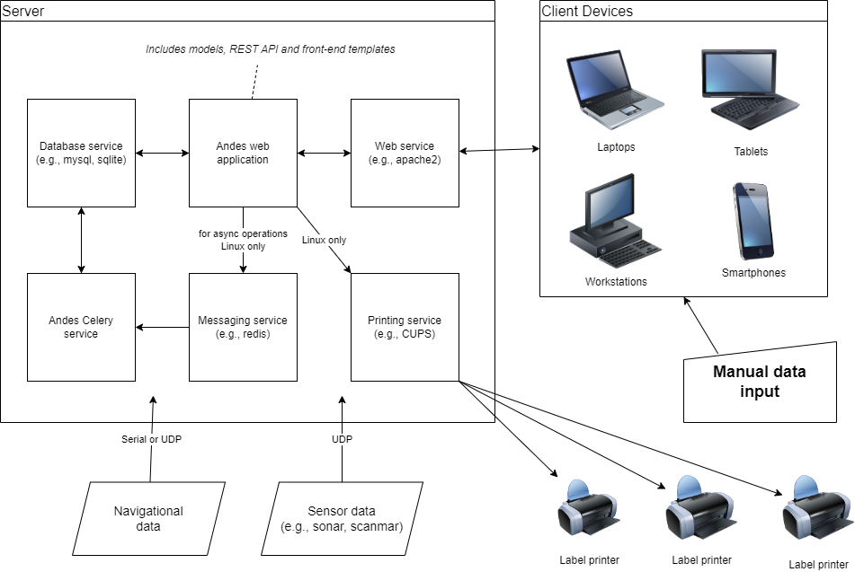

# Figures

(ref:arch-caption) The generalized system architecture diagram of the Andes application and its associated services.

```{r arch, fig.cap="(ref:arch-caption)", out.width='1.0\\linewidth'}

```
\clearpage


(ref:ERD-caption) A simplified entity relationship diagram of the data model used by the Ecosystem Survey app of \gls{andes}.

```{r ERD, fig.cap="(ref:ERD-caption)", out.width='1.0\\linewidth'}
knitr::include_graphics("./figures/erd_ecosystem_survey.png")
```
\clearpage

(ref:andes-splashpage-caption) User interface of Another data entry system (Andes) showing the eight principal components of the application.

```{r andes-splashpage, fig.cap="(ref:andes-splashpage-caption)", out.width='1.0\\linewidth'}
knitr::include_graphics("./figures/andes-splash.png")
```
\clearpage


(ref:dashboard-caption) Dashboard.

```{r dashboard, fig.cap="(ref:dashboard-caption)", out.width='1.0\\linewidth'}
knitr::include_graphics("./figures/temp.png")
```
\clearpage

(ref:bridge-caption) Bridge console.

```{r bridge, fig.cap="(ref:bridge-caption)", out.width='1.0\\linewidth'}
knitr::include_graphics("./figures/temp.png")
```
\clearpage

(ref:forecast-caption) Forecast tool.

```{r forecast, fig.cap="(ref:forecast-caption)", out.width='1.0\\linewidth'}
knitr::include_graphics("./figures/temp.png")
```
\clearpage

(ref:progress-caption) Progress map.

```{r progress, fig.cap="(ref:progress-caption)", out.width='1.0\\linewidth'}
knitr::include_graphics("./figures/temp.png")
```
\clearpage


(ref:andes-wetlab1-caption) User interface of the Ecosystem Survey component of Andes when in use for processing samples in the wet laboratory. The screen capture presented here shows sampling of capelin lengths on an active set being processed in the lab.

```{r andes-wetlab1, fig.cap="(ref:andes-wetlab1-caption)", out.width='1.0\\linewidth'}
knitr::include_graphics("./figures/andes-wetlab1.png")
```
\clearpage

(ref:oceanography-caption) Oceanography app.

```{r oceanography, fig.cap="(ref:oceanography-caption)", out.width='1.0\\linewidth'}
knitr::include_graphics("./figures/temp.png")
```
\clearpage


(ref:portsampling1-caption) User interface of the Port sampling component of Andes when in use for processing samples in the field.

```{r portsampling1, fig.cap="(ref:portsampling1-caption)", out.width='1.0\\linewidth'}
knitr::include_graphics("./figures/portsampling1.png")
```
\clearpage

