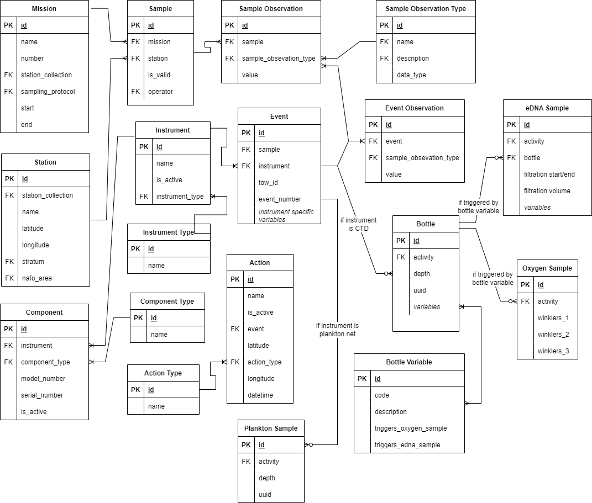

# Figures


(ref:arch-caption) The generalized system architecture diagram of the Andes application and its associated services.
```{r arch, fig.cap="(ref:arch-caption)", out.width='1.0\\linewidth'}
knitr::include_graphics("./figures/architecture.png")
```
\clearpage

(ref:ab-form-caption) A screenshot of the "Length-to-Weight Ratio" section of the sampling requirement form. Andes offers the option to specify regression coefficients for males, females or unspecified individuals to be used in quality control.
```{r screenshot-ab-form, fig.cap="(ref:ab-form-caption)", out.width='1.0\\linewidth'}

```
\clearpage

(ref:mature-length-form-caption) A screenshot of the "Mature Length" section of the sampling requirement form. Andes offers the option to specify mature length thresholds for males, females or unspecified individuals to be used in quality control.
```{r screenshot-mature-length-form, fig.cap="(ref:mature-length-form-caption)", out.width='1.0\\linewidth'}
knitr::include_graphics("./figures/screenshot_qc_mature_length_form.png")
```
\clearpage

(ref:screenshot-index-caption) A screenshot of the main index page of Another data entry system (Andes) showing the principal modules of the application. Which are displayed on the index page will depend both the users permissions and profile.
```{r screenshot-index, fig.cap="(ref:screenshot-index-caption)", out.width='1.0\\linewidth'}
knitr::include_graphics("./figures/screenshot_index.png")
```
\clearpage

(ref:screenshot-fishing-console-caption) A screenshot of Andes Fishing Console withing the Bridge App. This screenshot shows some quality control validation features including: the fishing timer, the distance display and an alarm message for when the vessel is travelling outside the target stratum. On the bottom left of the screenshot, output from the net monitoring system is displayed. The large buttons in the center of the display are used to trigger fishing events.
```{r screenshot-fishing-console, fig.cap="(ref:screenshot-fishing-console-caption)", out.width='1.0\\linewidth'}
knitr::include_graphics("./figures/screenshot_bridge_console.png")
```
\clearpage

(ref:bridge-caption) A screenshot of the Andes Bridge console. This app is used by bridge personnel across multiple user scenarios. This dashboard is a critical link in the communication between the scientist and crew personnel. An example of this is the station list; as a chief scientist plans out his or her route, queue stations and the associated activities will appear in the Bridge console. The Bridge console is also used by bridge officers to trigger the start and ends of operations and to input set metadata.
```{r screenshot-bridge-console, fig.cap="(ref:bridge-caption)", out.width='1.0\\linewidth'}
knitr::include_graphics("./figures/screenshot_bridge_console.png")
```
\clearpage

(ref:dashboard-caption) A screenshot of the Andes Cruise Dashboard. This dashboard helps to communicate queued stations, fishing activities underway and estimated times of arrival to science staff and crew personnel. The dashboard also displays high level summaries of Science activities that were conducted.
```{r dashboard, fig.cap="(ref:dashboard-caption)", out.width='1.0\\linewidth'}
knitr::include_graphics("./figures/screenshot_dashboard.png.png")
```
\clearpage

(ref:erd-ecosystem-survey-caption) A simplified entity relationship diagram of the data model used by the Ecosystem Survey app of \gls{andes}.
```{r erd-ecosystem-survey, fig.cap="(ref:erd-ecosystem-survey)", out.width='1.0\\linewidth'}
knitr::include_graphics("./figures/erd_ecosystem_survey.png")
```
\clearpage

(ref:screenshot-wetlab-active-set-caption) A screenshot of the Active Set page. This page is a component of the Ecosystem Survey app where end users who are working in the wet laboratory will identify new catches.
```{r screenshot-wetlab-active-set, fig.cap="(ref:screenshot-wetlab-active-set-caption)", out.width='1.0\\linewidth'}
knitr::include_graphics("./figures/screenshot_wetlab_active_set.png")
```
\clearpage

(ref:screenshot-wetlab-catch-card-caption) User interface of the Ecosystem Survey component of Andes when in use for processing samples in the wet laboratory. The screen capture presented here shows sampling of capelin lengths on an active set being processed in the lab.
```{r screenshot-wetlab-catch-card, fig.cap="(ref:screenshot-wetlab-catch-card-caption)", out.width='1.0\\linewidth'}
knitr::include_graphics("./figures/screenshot_wetlab_catch_card.png")
```
\clearpage


(ref:screenshot-wetlab-data-entry-caption) User interface of the Ecosystem Survey component of Andes when in use for processing samples in the wet laboratory. The screen capture presented here shows sampling of capelin lengths on an active set being processed in the lab.
```{r screenshot-wetlab-data-entry, fig.cap="(ref:screenshot-wetlab-data-entry-caption)", out.width='1.0\\linewidth'}
knitr::include_graphics("./figures/screenshot_wetlab_data_entry.png")
```
\clearpage


(ref:ERD-OCEAN-caption) A simplified entity relationship diagram of the data model used by the Oceanography app of \gls{andes}.

```{r ERD-OCEAN, fig.cap="(ref:ERD-OCEAN-caption)", out.width='1.0\\linewidth'}

```
\clearpage


(ref:ERD-PORT-caption) A simplified entity relationship diagram of the data model used by the Port Sampling app of \gls{andes}.

```{r ERD-PORT, fig.cap="(ref:ERD-PORT-caption)", out.width='1.0\\linewidth'}
knitr::include_graphics("./figures/erd_port.png")
```
\clearpage


(ref:forecast-caption) Forecast tool.

```{r forecast, fig.cap="(ref:forecast-caption)", out.width='1.0\\linewidth'}
knitr::include_graphics("./figures/temp.png")
```
\clearpage

(ref:progress-caption) Progress map.

```{r progress, fig.cap="(ref:progress-caption)", out.width='1.0\\linewidth'}
knitr::include_graphics("./figures/temp.png")
```
\clearpage


(ref:oceanography-caption) Oceanography app.

```{r oceanography, fig.cap="(ref:oceanography-caption)", out.width='1.0\\linewidth'}
knitr::include_graphics("./figures/temp.png")
```
\clearpage


(ref:portsampling1-caption) User interface of the Port sampling component of Andes when in use for processing samples in the field.

```{r portsampling1, fig.cap="(ref:portsampling1-caption)", out.width='1.0\\linewidth'}
knitr::include_graphics("./figures/screenshot_port.png")
```
\clearpage


