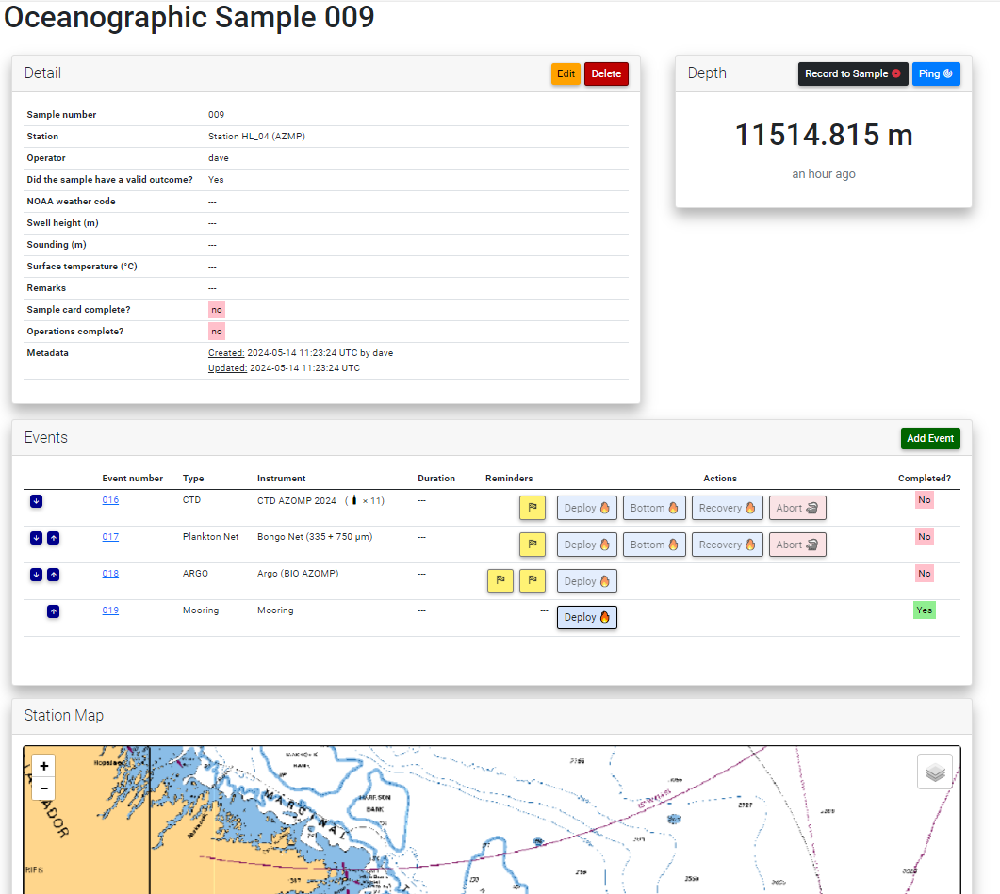

# Figures

(ref:arch-caption) The generalized system architecture diagram of the Andes application and its associated services. The terms \gls{udp} and \gls{cups} are defined in the Glossary section.
```{r arch, fig.cap="(ref:arch-caption)", out.width='1.0\\linewidth'}
knitr::include_graphics("./figures/architecture.png")
```
\clearpage

(ref:screenshot-index-caption) A screenshot of the main index page of Another data entry system (Andes) showing the principal modules of the application. What is displayed on the index page will depend both on the user's permissions and profile.
```{r screenshot-index, fig.cap="(ref:screenshot-index-caption)", out.width='1.0\\linewidth'}
knitr::include_graphics("./figures/screenshot_index.png")
```
\clearpage

(ref:bridge-caption) A screenshot of the Andes Bridge console. This app is used by bridge personnel across multiple user scenarios. This dashboard is a critical link in the communication between the scientist and crew personnel. An example of this is the station list; as a chief scientist plans out his or her route, queued stations and the associated activities will appear in the Bridge console. The Bridge console is also used by bridge officers to trigger the start and end of operations and to input set metadata.

```{r screenshot-bridge-console, fig.cap="(ref:bridge-caption)", out.width='1.0\\linewidth'}

```
\clearpage

(ref:dashboard-caption) A screenshot of the Andes Cruise Dashboard. This dashboard helps to communicate queued stations, fishing activities underway and estimated times of arrival to science staff and crew personnel. The dashboard also displays high level summaries of Science activities that were conducted.
```{r screenshot-dashboard, fig.cap="(ref:dashboard-caption)", out.width='1.0\\linewidth'}

```
\clearpage

(ref:screenshot-fishing-console-caption) A screenshot of Andes Fishing Console within the Bridge module. This screenshot shows some quality control validation features including: the fishing timer, the distance display and an alarm message for when the vessel is travelling outside the targeted stratum. On the bottom left of the screenshot, output from the net monitoring system is displayed. The large buttons in the center of the display are used to trigger fishing events.
```{r screenshot-fishing-console, fig.cap="(ref:screenshot-fishing-console-caption)", out.width='1.0\\linewidth'}
knitr::include_graphics("./figures/screenshot_fishing_console.png")
```
\clearpage

(ref:screenshot-trawl-validation) A screenshot of Andes Net Sensor Validation Console within the Bridge module. This screenshot shows the collected inputs from all the defined sensors over the course of a fishing set or sample. In each graph, the input values are plotted over time and vertical lines represent triggered events (e.g., net deployed, winches locked, etc.). This console is a valuable tool for fishing personnel, allow them to verify the adherence to protocols and ensure tow validity.
```{r screenshot-trawl-validation, fig.cap="(ref:screenshot-trawl-validation)", out.width='1.0\\linewidth'}

```
\clearpage

(ref:erd-ecosystem-survey-caption) A simplified entity relationship diagram of the data model used by the Ecosystem Survey module of \gls{andes}.
```{r erd-ecosystem-survey, fig.cap="(ref:erd-ecosystem-survey-caption)", out.width='1.0\\linewidth'}
knitr::include_graphics("./figures/erd_ecosystem_survey.png")
```
\clearpage

(ref:screenshot-wetlab-active-set-caption) A screenshot of the Active Set page. This page is a component of the Ecosystem Survey module. Users in the wet laboratory enter new catches into this page as they are identified.
```{r screenshot-wetlab-active-set, fig.cap="(ref:screenshot-wetlab-active-set-caption)", out.width='1.0\\linewidth'}
knitr::include_graphics("./figures/screenshot_wetlab_active_set.png")
```
\clearpage

(ref:screenshot-wetlab-catch-card-caption) A screenshot of the Catch Card page of the Ecosystem Survey module of Andes. This is where new baskets and their associated weights are entered. This example shows the catch card of Atlantic Cod from a Maritimes Region survey of the George Bank.
```{r screenshot-wetlab-catch-card, fig.cap="(ref:screenshot-wetlab-catch-card-caption)", out.width='1.0\\linewidth'}
knitr::include_graphics("./figures/screenshot_wetlab_catch_card.png")
```
\clearpage

(ref:screenshot-wetlab-data-entry-caption) A screenshot of the specimen data entry interface of the Ecosystem Survey module of Andes. The specimen observations are edited on the left-hand side while the sampling collections are displayed on the right-hand side.
```{r screenshot-wetlab-data-entry, fig.cap="(ref:screenshot-wetlab-data-entry-caption)", out.width='1.0\\linewidth'}
knitr::include_graphics("./figures/screenshot_wetlab_data_entry.png")
```
\clearpage

(ref:screenshot-shrimps-caption) A screenshot displaying the Shrimps module user interface. This is the page where baskets of shrimps are entered and subsequently detailed according to their various protocols.
```{r screenshot-shrimps, fig.cap="(ref:screenshot-shrimps-caption)", out.width='1.0\\linewidth'}

```
\clearpage


(ref:screenshot-charts-caption) A screenshot of the Charts module showing the weight vs length scatter plot on top of its growth curve model.
```{r screenshot-charts, fig.cap="(ref:screenshot-charts-caption)", out.width='1.0\\linewidth'}

```
\clearpage


(ref:oceanography-instrument-type-configuration-caption) A screenshot portraying how the configuration of "oceanographic events" associated with a certain type of instrument can be customized. In this example, the configuration for plankton nets are being displayed. The box on above contains a list of user-defined "actions types" that will be associated with the event. Action types can be set to optional or mandatory. The lower box displays the list of user-defined fields that will be collected for all plankton nets. Fields can be set to be optional or mandatory and default values can be specified.
```{r oceanography-instrument-type-configuration, fig.cap="(ref:oceanography-instrument-type-configuration-caption)", out.width='1.0\\linewidth'}

```
\clearpage


(ref:screenshot-oceanography-sample-caption) A screenshot of the Oceanographic Sample detail page from the Andes Oceanography module. The top-most box contains high-level information about the sample, such as the sequential sample number, station name and meteorological information collected at the time of sampling. These fields are user-defined and can be customized in the mission configuration. The middle box contains a list of events that are associated with the sample. The event number, event status, reminders and available actions are displayed for each row of the event. Actions can be triggered either manually or by clicking on the button associated with that action. The event table also contains convenient buttons (left-hand side) for quickly adjusting the order of an event.
```{r screenshot-oceanography-sample, fig.cap="(ref:screenshot-oceanography-sample-caption)", out.width='1.0\\linewidth'}

```
\clearpage

(ref:screenshot-oceanography-event-ctd-caption) A screenshot from the Andes Oceanography module of the event detail page for a CTD/Rosette system. The event being portrayed has the event number 016 and the name of the instrument being used is "CTD AZOMP 2024". The top-most box contains high-level information associated with the event that is specific to the instrument type (i.e., CTD). These fields are user-defined and can be customized in the mission configuration. Below this is a table of water samples (i.e., "bottles") associated with this event. The unique identifier, depth and which variables were measured are displayed for each row of the table. Lower down on this page (not displayed) is a table of the actions that were logged from this event.
```{r screenshot-oceanography-event-ctd, fig.cap="(ref:screenshot-oceanography-event-ctd-caption)", out.width='1.0\\linewidth'}

```
\clearpage

(ref:screenshot-oceanography-event-zooptow-caption) A screenshot from the Andes Oceanography module of the event detail page for a plankton net. The event being portrayed has the event number 006 and the name of the instrument being used is "Plankton Net (202µm)". The top-most box contains high-level information associated with the event that is specific to the instrument type (i.e., plankton net). These fields are user-defined and can be customized in the mission configuration. Below this is a table of collected zooplankton samples associated with this event. The unique identifier, net mesh size and depth interval are displayed for each row of the table. Further down the page, is a table listing all the actions logged from this event.
```{r screenshot-oceanography-event-zooptow, fig.cap="(ref:screenshot-oceanography-event-zooptow-caption)", out.width='1.0\\linewidth'}

```
\clearpage

(ref:erd-oceanography-caption) A simplified entity relationship diagram of the data model used by the Oceanography module of \gls{andes}.
```{r erd-oceanography, fig.cap="(ref:erd-oceanography-caption)", out.width='1.0\\linewidth'}
knitr::include_graphics("./figures/erd_oceanography.png")
```
\clearpage

(ref:screenshot-forecast-caption) A screenshot of the Track Forecast tool.
```{r screenshot-forecast, fig.cap="(ref:screenshot-forecast-caption)", out.width='1.0\\linewidth'}
knitr::include_graphics("./figures/screenshot_forecast.png")
```
\clearpage

(ref:screenshot-progress-caption) A screenshot of the Andes Progress map. The map colors strata by the status of their set quotas. The green strata are those which have met their specified targets of set conducted; those in yellow have not met the target but have surpassed the minimum; and those in red have not conducted the minimum specified number of sets.
```{r screenshot-progress, fig.cap="(ref:screenshot-progress-caption)", out.width='1.0\\linewidth'}
knitr::include_graphics("./figures/screenshot_progress.png")
```
\clearpage

(ref:screenshot-port-protocol-caption) A screenshot displaying the Port Sampling module protocol form. The selections made in this form will affect the behaviour of the module during data entry.
```{r screenshot-port-protocol, fig.cap="(ref:screenshot-port-protocol-caption)", out.width='1.0\\linewidth'}

```
\clearpage

(ref:screenshot-port-data-entry-caption) A screenshot displaying the Port Sampling data entry page. A button is presented for each length bin, as defined in the protocol. The number in the black circle on the right-hand side of the button is the current count for that length bin. Button colors change from blue to green as the collection protocol for that bin is satisfied.
```{r screenshot-port-data-entry, fig.cap="(ref:screenshot-port-data-entry-caption)", out.width='1.0\\linewidth'}
knitr::include_graphics("./figures/screenshot_port_data_entry.png")
```
\clearpage

(ref:erd-port-caption) A simplified entity relationship diagram of the data model used by the Port Sampling module of \gls{andes}.
```{r erd-port, fig.cap="(ref:erd-port-caption)", out.width='1.0\\linewidth'}
knitr::include_graphics("./figures/erd_port.png")
```
\clearpage

(ref:ab-form-caption) A screenshot of the "Length-to-Weight Ratio" section of the sampling requirement form. Andes offers the option to specify regression coefficients for males, females or unspecified individuals to be used in quality control.
```{r screenshot-ab-form, fig.cap="(ref:ab-form-caption)", out.width='1.0\\linewidth'}
knitr::include_graphics("./figures/screenshot_qc_ab_form.png")
```
\clearpage

(ref:mature-length-form-caption) A screenshot of the "Mature Length" section of the sampling requirement form. Andes offers the option to specify mature length thresholds for males, females or unspecified individuals to be used in quality control.
```{r screenshot-mature-length-form, fig.cap="(ref:mature-length-form-caption)", out.width='1.0\\linewidth'}

```
\clearpage


